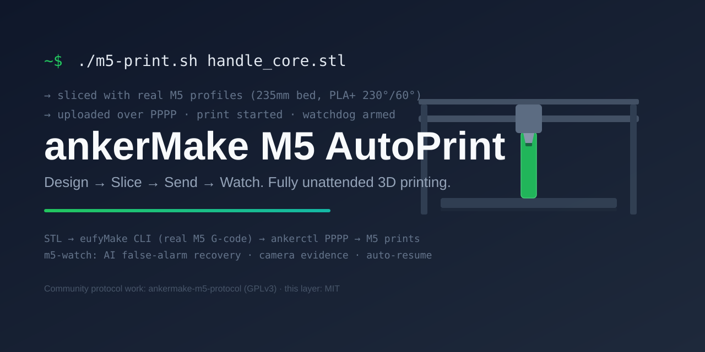

# ankerMake M5 AutoPrint



**Print to an AnkerMake M5 from the command line — design → slice → send → watch, fully unattended.**

A workflow layer on top of the community [ankermake-m5-protocol](https://github.com/Ankermgmt/ankermake-m5-protocol) (`ankerctl`) that makes the M5 genuinely scriptable:

- **`m5-print.sh`** — one-shot: STL → real M5 G-code → uploaded & printing. Zero clicks.
- **`m5-watch.py`** — unattended-print watchdog: catches AI false-alarm pauses (black-on-black filament is a classic), auto-resumes, saves before/after camera evidence.
- **`m5`** — daily driver wrapper (status / monitor / gcode / send / print / find / list / camera / shot / refresh).
- **`m5-setup.sh`** — one-time auth + LAN re-point (see setup).

Everything here was learned the hard way on a real M5 (2026-09). The pitfalls section is the value.

> ⚠️ **Not affiliated with Anker/eufyMake.** The M5 protocol was reverse-engineered by the ankerctl community. Use at your own risk — these tools send real commands to real hardware.

---

## Why this exists

The AnkerMake M5 is a great printer with a terrible automation story:

- No web UI, no local API, no static-IP option, minimal touchscreen menus.
- The official slicer (AnkerMake Studio → now **eufyMake Studio 3D**) is GUI-only on the surface… **but it's a PrusaSlicer fork with a hidden headless CLI** that carries the *real* M5 machine profiles.
- The printer accepts file transfers over a custom LAN P2P protocol (PPPP, UDP 32108) — which `ankerctl` implements.
- The cloud MQTT channel carries status, temps, and commands — the thing you monitor.

Chain those together and you get a fully scriptable printer:

```
STL → eufyMake Studio CLI (real M5 slice) → ankerctl PPPP upload → M5 prints → m5-watch guards it
```

## Requirements

- macOS (paths assume it; Linux needs small path tweaks)
- [ankerctl](https://github.com/Ankermgmt/ankermake-m5-protocol) checked out, e.g. `~/Documents/3D Printing/ankerctl`, with:
  - `.venv` on **Python 3.10+** (system Python 3.9 is too old — dataclass `kw_only` crashes)
  - deps installed (`requirements.txt`)
  - auth imported (see Setup)
- **eufyMake Studio 3D** (or AnkerMake Studio) installed — its CLI is the slicer
- `ffmpeg` (for camera frames; `brew install ffmpeg`)
- An AnkerMake account with the printer bound to it

## Setup

1. **Install ankerctl** and its Python venv (Python 3.10+, not 3.9):
   ```bash
   git clone https://github.com/Ankermgmt/ankermake-m5-protocol.git ~/Documents/3D Printing/ankerctl
   cd ~/Documents/3D Printing/ankerctl
   python3.12 -m venv .venv
   ./.venv/bin/pip install -r requirements.txt
   ```
2. **Import your Anker account** into ankerctl. The account token lives in eufyMake Studio 3D's WebKit LocalStorage on macOS:
   ```bash
   # ~/Library/WebKit/com.anker.eufystudio3d/WebsiteData/Default/*/LocalStorage/localstorage.sqlite3
   # key `vms-userinfo` — decode: UTF-16LE → base64 → percent-unescape → JSON {auth_token, ...}
   ./ankerctl.py config import /path/to/login.json   # or build login.json from the decoded token
   ```
   `m5-setup.sh` automates token extraction + import + LAN re-probe (the printer's DHCP IP drifts from the cloud record; this re-points ankerctl at the live address).
3. **Slicer path**: set `EUFY_BIN` if eufyMake Studio isn't in `/Applications`.

## Usage

```bash
# One-shot print (the whole point):
./m5-print.sh model.stl

# Watch an unattended print (AI-pause watchdog + auto-resume + camera evidence):
python3 m5-watch.py --auto-resume

# Daily driver:
./m5 status        # live temp/state stream
./m5 list          # account + printer info
./m5 shot          # grab a camera frame → /tmp/m5shot.jpg
./m5 gcode         # interactive raw-gcode prompt
./m5 send 1002     # firmware query
```

## How the M5 actually works (read this before debugging)

Two channels:

1. **PPPP (UDP)** — presence + file transfers. LAN port **32108**. A `LAN_SEARCH` probe gets a `PktPunchPkt` back carrying the printer DUID. Broadcast search is often swallowed by routers — a **unicast sweep** (probe every .1–254) reliably finds printers.
2. **Cloud MQTT** (`make-mqtt.ankermake.com`, TLS + AES payloads) — status, temps, commands. The printer connects **outbound**, so status works regardless of LAN IP; only file transfers need a reachable IP.

Key command IDs: `1002` firmware, `1003/1004` nozzle/bed temps, `1039` BREAK_POINT (resume), `1052` model layer.

## Pitfalls (each one cost real time)

- **The M5 prints only sliced AnkerMake-flavor G-code — never raw STL.** An STL upload "succeeds" but squats the printer's single-file slot and does nothing.
- **Single-file slot**: the M5 holds exactly ONE uploaded file. A leftover staged file (e.g. a `--no-act` test upload) makes the next real send fail with eufyMake's `0xFF01030005 "Failed to transfer Gcode"`. Clear with a PPPP ABORT or a printer reboot.
- **Stale cloud IP trap**: eufyMake Studio targets the cloud-recorded IP. After a DHCP lease change its sends fail while MQTT status keeps working. The printer reports its IP only on boot, power-cycling doesn't reliably refresh it, and there is **no static-IP option** on the printer or in the app. Durable fix: DHCP reservation at the router. Agent-side fix: re-probe the LAN and rewrite ankerctl's config (`m5-setup.sh`).
  - **`ankerctl.py config import` is destructive**: it rebuilds the config from the cloud and reverts your manually-corrected `ip_addr` to the stale value. Never run it bare mid-session; always follow with the LAN re-probe.
- **Silent 200 mm slice**: slicing headlessly *without* a resolvable M5 profile silently succeeds with a generic 200×200 mm printer — the output looks fine and prints wrong. **Always verify `bed_shape = 0x0,235x0,235x235,0x235` in the G-code header** before sending. `m5-print.sh` does this check.
- **The eufyMake CLI ignores `--printer-profile`** (unlike PrusaSlicer). Pass the real M5 values as direct config-key overrides (`--bed-shape`, `--nozzle-diameter`, `--first-layer-temperature=230`, etc.) — that reliably lands the 235 mm bed. See `m5-print.sh` for the full working invocation.
- **GUI click-driving is a dead end**: PrusaSlicer/eufyMake wxWidgets dropdowns ignore synthetic clicks and aren't AX-accessible. Use the headless CLI. (Loading a file into a running GUI instance works by invoking the binary with the file path — single-instance forwarding.)
- **`event_notify` semantics**: `subType=1 value=1` is the normal ~3 s heartbeat while printing — NOT a pause. `value=8` appears during homing/auto-level. Real pauses surface as `AIPausePrint=1` on `print_schedule` or non-heartbeat event values.
- **"Is it actually printing?" ground truth**: `print_schedule.totalTime` climbing + `realSpeed` varying (15–60) = actively printing. `model_layer.real_print_layer` advancing. The camera can show an "empty bed" for small center-bed parts (FOV) or black-on-black filament — cross-check MQTT before believing a failure.
- **AI false alarms with black filament**: the AI camera cannot distinguish black filament from the black PEI bed. For black parts, prefer `AISwitch=0` or run `m5-watch.py --auto-resume` and let it recover false pauses automatically.
- **Python 3.12 fixes for ankerctl** (upstream may still need these):
  - `libflagship/mqtt.py` `_MqttMsg`: `padding` (11 null bytes) and `data` need dataclass defaults, else the send path crashes: *"missing 1 required positional argument: 'padding'"*.
  - Use `Duid.from_string("...")` for DUID construction (raw `Duid(prefix=bytes, ...)` breaks the string pack path).
- **A hanging `pppp print-file` with an otherwise-idle printer = stale target IP**, not a flaky channel. The CLI logs `using ip <x>` right before connecting — verify that IP answers a live unicast probe first.

## Camera & evidence

The M5's onboard camera is reachable mid-print without disruption:

```bash
./ankerctl.py pppp capture-video -m 400kb /tmp/shot.h264
ffmpeg -y -i /tmp/shot.h264 -frames:v 1 -update 1 /tmp/shot.jpg
```

`m5-watch.py` does this automatically on an AI alarm — before/after frames land in `~/m5-shots/` so a false alarm is visually verifiable. (Caveat: black-on-black and small parts may be outside what the camera can show — same blind spot as the AI.)

## License

MIT — this workflow layer. The underlying `ankerctl`/protocol work is GPLv3 (see its repo). The M5 protocol itself is unofficial, reverse-engineered, and not endorsed by Anker.
